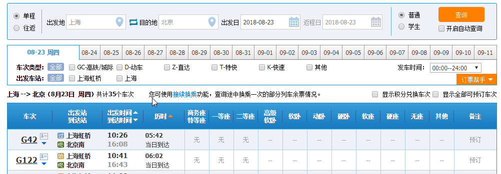
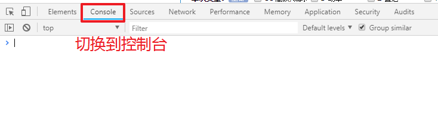
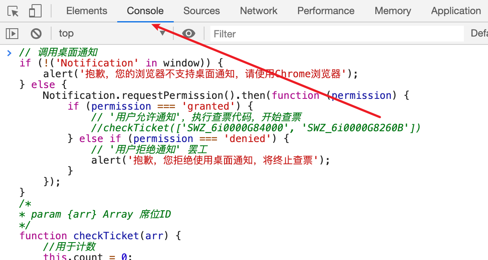
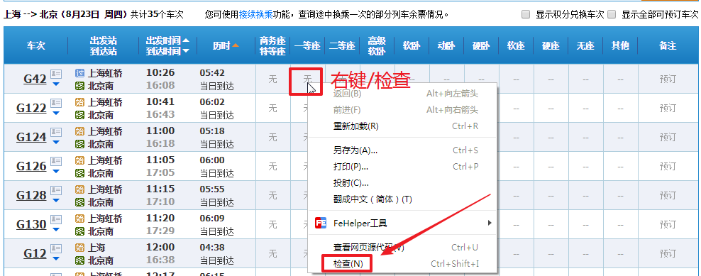
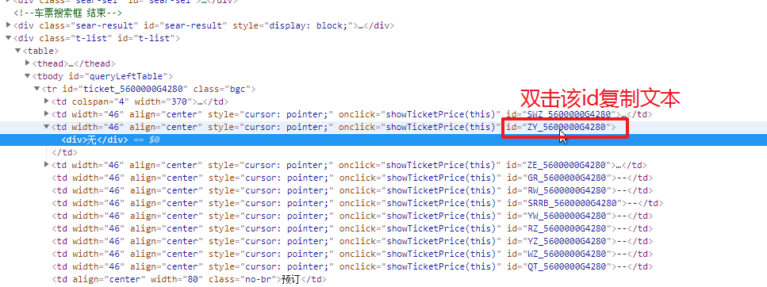
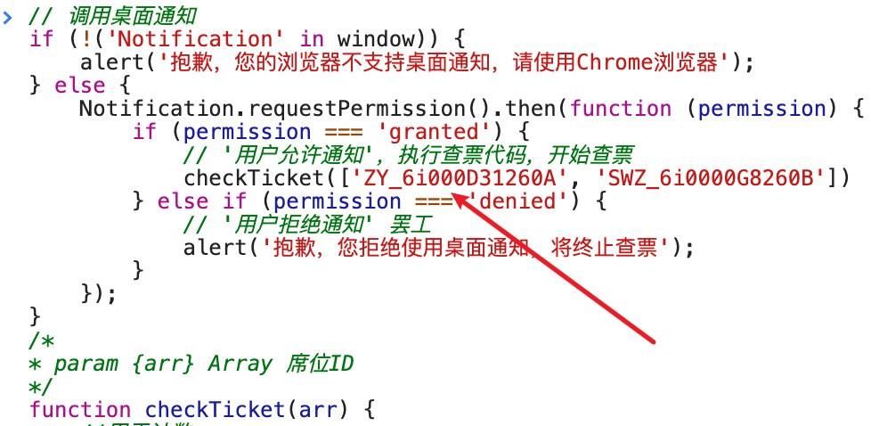

# check-ticket
> 12306 lowB 查票法【帮你第一时间发现增售票、他人退票】 <b style='color:red'>只能查票，不能买！！！要买查到以后手动买</b> 国庆快到了，拿去用吧，不用谢。

> 适用人群：一直在电脑前工作的人

> 所选车次无票时使用

## 使用方法
1. 打开 https://kyfw.12306.cn/otn/leftTicket/init 正常查询你要的列车信息
  
2. 在浏览器中F12，打开调试工具，
  
3. 在控制台中输入或粘贴代码
  
4. 在你所需列车无票的席位上右键-检查，查找对应id
  
5. 复制对应id 
  
6. 替换代码中的原有id（重复4-6可查询多个席位）
  
7. 回车运行代码
8. 等待查询结果 不要关闭该页面 在这期间你可以随便在电脑上干别的 全屏的事情除外不然可能看不到通知
9. 收到提示 登录账户手动买票。。。 
